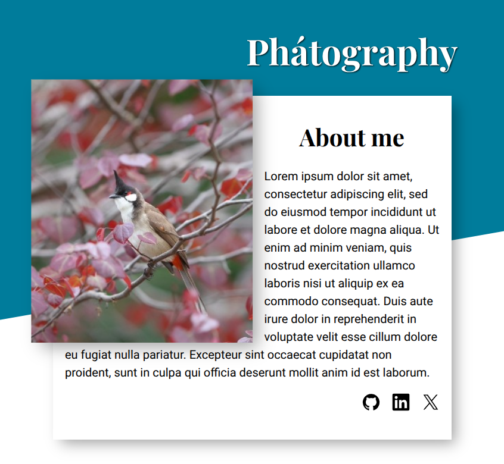

# homepage
A homepage design responsive on mobile, tablet, and desktop screen sizes. Additionally features WCAG compliance, performant animations, and responsive imagery. 

Pictures provided by... my father :)

## Reflection

### major concepts utilized:
- media queries
- responsive images to optimize download size and UX: size & resolution switching, art direction
- animations & transitions
- WCAG (AA & AAA) practices to enhance perceivability, operability, understandablity, and robustness: 
  - using semantic html, color contrast, keyboard navigation, responsive widths/heights, meaningful text for links and images, and ARIA to create accessible names
- performance enhancement by optimizing repaints: more efficient stacking contexts, will-change property used sparingly (it does not trigger repaints; wow!)
- using accessibility & performance auditing tools: 
  - Accessibility Tree and Accessibility Panel (Chrome Devtools)
  - Lighthouse (within Chrome Devtools)
  - 'Rendering' tab: highlighting repaints, fps stats, emulate vision deficiencies, emulate dark mode
  - 3D View (Edge Devtools) for visualizing stack contexts
  - CSS Stacking Context inspector (a chrome extension)

### did well:
- layouts follow the design and no overflows on screen sizes >=320px
- scored 100 on Lighthouse's accessibility audit and passed manual checks
- implementing art direction (there was a sincere attempt at size-switching but idk if I did it right since the browser never seems to want to take my image suggestions)
- optimizing repaints by creating and reordering stacking contexts
- careful selection of semantic html elements and ARIA labeling for anything lacking semantics
- reading [WCAG checklist](https://webaim.org/standards/wcag/checklist) and implementing applicable ones (e.g. 1.4.4, 1.4.10, 2.4.13, 1.4.12)
- preventing and debugging overflows 
- using more helper classes than last time

### room for improvement:
- known repaint behavior: hovering over a project card repaints all the following cards. can this be prevented or improved? 
- less spaghetti code for padding and margins
- learn how to generate responsive images automatically (they're a pain to create and configure manually)
- learn how to <em>test</em> responsive images
- use webp to improve image download size, only using jpg as fallback
- more complex animations
- resize images to the space actually used, to improve image download size 
- not having a separate image element for the tablet layout. bad for download and not needed if you create a more adaptable header layout
- more consistently using utility classes: e.g. icons-row not applied consistently, and the gaps helper classes
- known bug: dark mode makes the first linkedin icon completely white

  

    <strong>additional sources of help</strong>
  

  <ul>
    <li>difference betw article and section: https://stackoverflow.com/questions/7549561/difference-between-section-vs-article-elements-in-html</li>
    <li>image logo as link: https://www.w3.org/WAI/tutorials/images/functional/#image-used-alone-as-a-linked-logo</li>
    <li>revert keyword: https://developer.mozilla.org/en-US/docs/Web/CSS/Reference/Values/revert</li>
    <li>aria-labelledby vs aria-describedby: https://stackoverflow.com/questions/63002101/is-there-any-guidance-on-when-to-choose-aria-describedby-instead-of-aria-labelle</li>
    <li>aria-label for address: https://webreference.com/html/tags/address/</li>
    <li>image resizer (behaves weird sometimes): https://www.adobe.com/express/feature/image/resize</li>
    <li>srcset for size switching not working: https://stackoverflow.com/questions/28650327/responsive-images-srcset-not-working</li>
    <li>will-change: https://developer.mozilla.org/en-US/docs/Web/CSS/Reference/Properties/will-change</li>
    <li>optimized LCP request discovery via: https://developer.mozilla.org/en-US/docs/Web/HTML/Reference/Attributes/fetchpriority</li>
  </ul>

